# 16-889 Assignment 2: Single View to 3D

Goals: In this assignment, you will explore the types of loss and decoder functions for regressing to voxels, point clouds, and mesh representation from single view RGB input.

Note:
1. The instructions to run are mentioned in each section.

## 1. Exploring loss functions

### 1.1. Fitting a voxel grid (5 points)

```bash
python fit_data.py --type 'vox'
```

- Corresponding loss code can be found [here](./losses.py)
- Corresponding visualization code can be found [here (visualize_voxels_as_mesh)](./utils_viz.py)

**Visualization**

| Optimized Voxel | Ground Truth |
| --------------- | ------------ |
|  |  |

### 1.2. Fitting a point cloud (10 points)

```bash
python fit_data.py --type 'point'
```

- Corresponding loss code can be found [here](./losses.py)
- Corresponding visualization code can be found [here (visualize_point_cloud)](./utils_viz.py)

**Visualization**

| Optimized Point Cloud | Ground Truth |
| --------------- | ------------ |
| 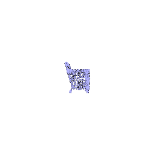 |  |

### 1.3. Fitting a mesh (5 points)

```bash
python fit_data.py --type 'mesh'
```

- Corresponding loss code can be found [here](./losses.py)
- Corresponding visualization code can be found [here (visualize_mesh)](./utils_viz.py)

**Visualization**

| Optimized Mesh | Ground Truth |
| --------------- | ------------ |
| 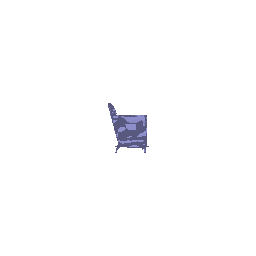 | 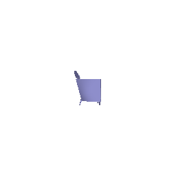 |


## 2. Reconstructing 3D from single view

### 2.1. Image to voxel grid (15 points)

```bash
# For training
python train_model.py --type 'vox' --max_iter 10001 --save_freq 2000

# For evaluation
python eval_model.py --type 'vox' --load_checkpoint --load_step 10000 --vis_freq 20
```

- Decoder architecture can be found [here](./model.py)

**Visualizing 3 examples**

| Ground Truth Image | Ground Truth Voxel | Predicted Voxel |
| ------------------ | ------------------ | --------------- |
| 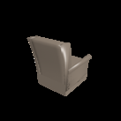 | 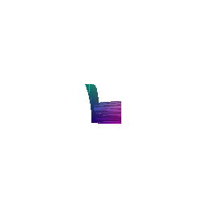 |  |
| 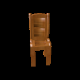 | 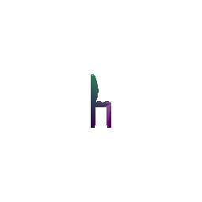 |  |
| 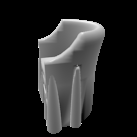 | 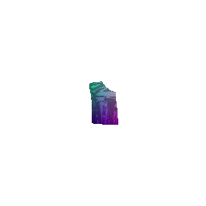 | 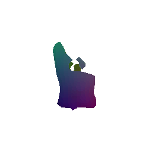 |

### 2.2. Image to point cloud (15 points)

```bash
# For training
python train_model.py --type 'point' --max_iter 10001 --save_freq 2000

# For evaluation
python eval_model.py --type 'point' --load_checkpoint --load_step 10000 --vis_freq 20
```

- Decoder architecture can be found [here](./model.py)

**Visualizing 3 examples**

| Ground Truth Image | Ground Truth Voxel | Predicted Voxel |
| ------------------ | ------------------ | --------------- |
| 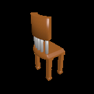 | 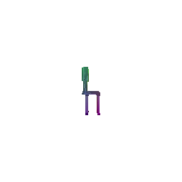 | 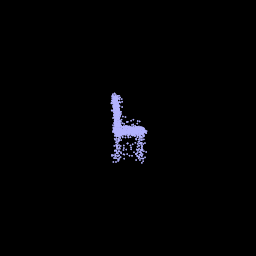 |
| 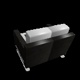 |  | 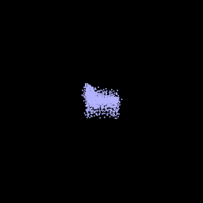 |
| 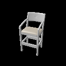 | 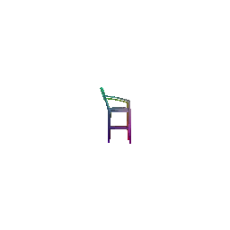 | 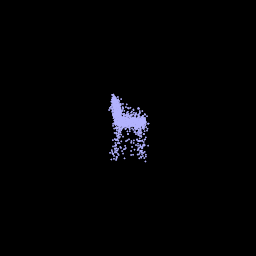 |


### 2.3. Image to mesh (15 points)

```bash
# For training
python train_model.py --type 'mesh' --max_iter 10001 --save_freq 2000

# For evaluation
python eval_model.py --type 'mesh' --load_checkpoint --load_step 10000 --vis_freq 20
```

- Decoder architecture can be found [here](./model.py)

**Visualizing 3 examples**

| Ground Truth Image | Ground Truth Voxel | Predicted Voxel |
| ------------------ | ------------------ | --------------- |
|  |  | 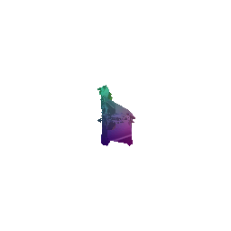 |
|  |  | 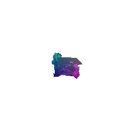 |
|  |  | 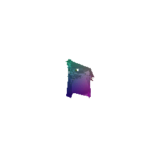 |

### 2.4. Quantitative comparisions(10 points)

| Avg F1@0.05 Vox | Avg F1@0.05 Point | Avg F1@0.05 Mesh |
| --------------- | ----------------- | ---------------- |
| 74.439 | 90.849 | 87.206 |

- Point clouds perform better than mesh as they are easier to predict and do not have the deformation constraints that meshes have. While the mesh decoder too outputs just vertex coordinates, it needs to learn about the connectivity between them as part of the initial shape (sphere in this case). So, the model is expected to understand more in comparison to the point cloud decoder and thus, the performance difference.
- Another reason why meshes do not perform/look as good is because of the initial shape itself. Chairs with holes cannot be predicted by this model because the initial shape/structure and its connectivity restricts it from deforming in that manner.
- Voxels seem to have performed the worse but I believe this is down to a few factors. The average dropped due to bad performance on some of the images. Where it did well, the visualizations looked really good. Thus, a slightly complex decoder would have led to better results (couldn't experiment due to time and compute constraints).

### 2.5. Analyse effects of hyperparms variations (10 points)

I tried playing around with the different tunable hyperparameters. I observed the following
- `n_points` - In case of meshes, the loss is given by<br>
`loss = args.w_chamfer * loss_reg + args.w_smooth * loss_smooth`<br>
The chamfer loss is being calculated as the sum of the distances and so, as `n_points` parameter is increased the number of points increases. With the chamfer loss being proportional to the number of points, it contributed more to the loss than the smoothness loss. Thus, the model, in this case, learns to lower the chamfer loss and so, the resulting meshes end up being spiky as the smoothness aspects are not touched.

    

- `w_smooth` - The obvious next step was to increase the smoothness weight. As the smoothness was increased (to great extents), the focus of the model shifted from accurately representing the chair to ensuring smoothness. As the value was increased, the resulting chairs were smoother but hardly showed any variations.

    

    And when the weight was pushed to a very high value, the model insisted on keeping everything planar and so, there were hardly any deformations in the sphere it began with.

    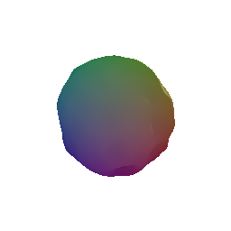

- `ico_sphere level` - The initial experiments of my mesh model always resulted in chair meshes with spiky legs. I believed this to be due the limited vertices and connectivity in the sphere. So, by increasing the level, I was able to increase the number of vertices and faces. I had to also increase the model complexity to handle the higher number of values to be predicted. The resulting images had much more rectangular structure in the legs.

    | level 4 | level 6|
    | ------- | ------ |
    | 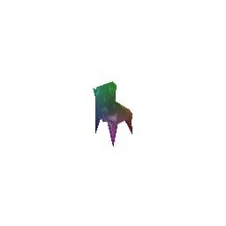 |  |


### 2.6. Interpret your model (15 points)

```bash
!python interpret_model.py --load_step 10000 --index1 100 --index2 340
```

For this question, all my experiments and observations are based on the point cloud encoder-decoder model.

- `What has the decoder learned` - One of the first thoughts that came to my mind when I saw this question was to actually understand what kind of information the decoder contains. In order to view this, I just ran the trained decoder on an encoded feature vector containing zeros. The output was the following

    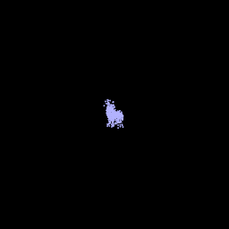

    As can be seen, the decoder contains the basic structure of a chair.

- `Latent Space Manipulation` - In order to understand the kind of information that the encoder captures, I tried to combine 2 encoded feature vectors at different weights

    | encoded2 | 0.25 * encoded1 + 0.75 encoded2 | 0.5 * encoded1 + 0.5 encoded2 | 0.75 * encoded1 + 0.25 encoded2 | encoded1 |
    | ------ | ----- | ----- | ----- | ----- |
    |  | 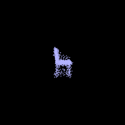 |  | 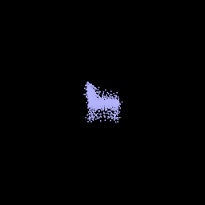 | 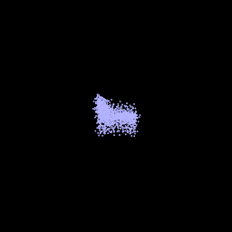 |

    From the above outputs, it is clear that the encoder captures information about different aspects of chair such as height, width, concavity, length of legs etc.

## 3. (Extra Credit) Exploring some recent architectures.

### 3.1 Implicit network (10 points)
Implement a implicit decoder that takes in as input 3D locations and outputs the occupancy value.
Some papers for inspiration [[1](https://arxiv.org/abs/2003.04618),[2](https://arxiv.org/abs/1812.03828)]

### 3.2 Parametric network (10 points)
Implement a parametric function that takes in as input sampled 2D points and outputs their respective 3D point.
Some papers for inspiration [[1](https://arxiv.org/abs/1802.05384),[2](https://arxiv.org/abs/1811.10943)]
