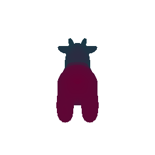
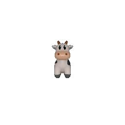
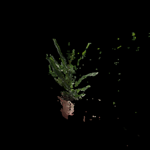
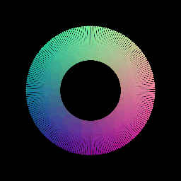
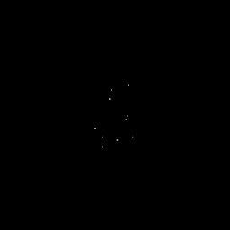
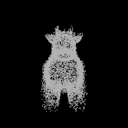

# 16-889 Assignment 1: Rendering Basics with PyTorch3D

Note:
- Most of the parameters have been hardcoded to get the required gif result.
- The command to run a question is shared in the corresponding question section.

## 1. Practicing with Cameras

### 1.1. 360-degree Renders (5 points)

```bash
python3 main.py -q 1.1
```


### 1.2 Re-creating the Dolly Zoom (10 points)

```bash
python3 main.py -q 1.2
```


## 2. Practicing with Meshes

### 2.1 Constructing a Tetrahedron (5 points)

```bash
python3 main.py -q 2.1
```


- Vertices - 4
- Faces (Triangular) - 4

### 2.2 Constructing a Cube (5 points)

```bash
python3 main.py -q 2.2
```


- Vertices - 8
- Faces (Triangular) - 12

## 3. Re-texturing a mesh (10 points)

```bash
python3 main.py -q 3
```



- `color1 = [0, 0.6, 0.6]`  and `color2 = [0.8, 0, 0.4]`.
- Color1 is essentially dark cyan with a hint of teal.
- Color2 is some shade similar to magenta.
- I chose thess colors cause they look pretty :)

## 4. Camera Transformations (20 points)

```bash
python3 main.py -q 4
```

| Transform | Intuition
| --- | ----------- |
| Flipped | R_relative is such that the axes are rotated about the z-axis. The matrix is created by understanding what the new axes would be oriented towards after rotation. The cow model needs to be rotated by 90 in clockwise. Thus, the camera is rotated by 90 counter-clockwise. Since the rotation is about the z axis, there's no need to change the position of the camera. So, T_relative would be all 0s. |
| Moved Away | The cow seems further away. This is done by moving the camera away. Thus, a further translation (T_relative) of 2 is added on top of the original 3. Thus, the camera is now at (0, 0, -5). |
| Shifted | The cow moves towards left and a bit upwards with respect to the camera as compared to the original. Thus, the camera is moved in the opposite manner - right (+ve x-axis) and down (-ve y axis). |
| Side-view | The cow is rotated by 90 clockwise about the positive y axis. Thus, the camera is first rotated 90 clounter-clockwise about y axis. Now along the rotated axes, the camera needs to be moved in its -ve x axis to reach the world fram origin and then along its +ve z axis to get the sideview.|





## 5. Rendering Generic 3D Representations

### 5.1 Rendering Point Clouds from RGB-D Images (10 points)

```bash
python3 main.py -q 5.1
```
| Plant1 | Plant2 | Plant_union |
| ------- | ------- | ------ |
|  |  |  |

### 5.2 Parametric Functions (10 points)

```bash
python3 main.py -q 5.2 -n 100
```

| Torus 100 | Torus 1000 |
| ------- | ------- |
|  |  |

### 5.3 Implicit Surfaces (15 points)

```bash
python3 main.py -q 5.3
```


**As per the rendering experience, meshes are easier and faster to render while retaining most of the 3d representational information. For a higher number of sampled points, the point cloud and mesh representations both have similar quality. However, mesh is able to render better at a faster speed and so, is more convenient to use.**

## 6. Do Something Fun (10 points)

```bash
python3 main.py -q 6
```

**UFO and an Alien**<br>


**I have used models of an alien and a UFO. I was able to align and make these camera facing by using different rotation matrices. Also, to get the intended motion, I had to play around with the translation matrices.**

## (Extra Credit) 7. Sampling Points on Meshes (10 points)

```bash
python3 main.py -q 7 -n 10000
```

**10 points sampled**<br>
<br><br>
**100 points sampled**<br>
<br><br>
**1000 points sampled**<br>
<br><br>
**10000 points sampled**<br>
<br><br>
