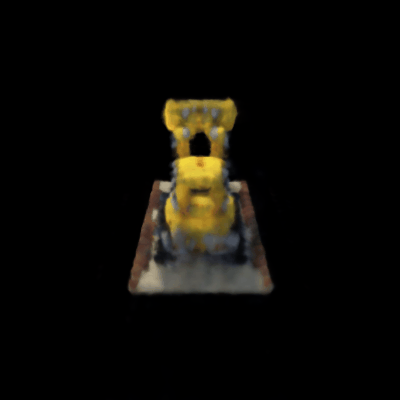

Assignment 3
===================================

Number of late days used - 0

##  1. Differentiable Volume Rendering - Point sampling (10 points) & Volume rendering (30 points)

```bash
python main.py --config-name=box
```

### Visualization

| Vis_Grid | Vis_Rays | Point Sampling | Depth Map | Volume Rendering |
| -------- | -------- | -------------- | --------- | ---------------- |
|  |  |  |  |  |

##  2. Optimizing a basic implicit volume - Random ray sampling (5 points) &  Loss and training (5 points)

```bash
python main.py --config-name=train_box
```
- Box center: (0.25, 0.25, 0.00)
- Box side lengths: (2.00, 1.50, 1.50)

##  Visualization

| Volume Rendering |
| ---------------- |
|  |


##  3. Optimizing a Neural Radiance Field (NeRF) (30 points)

```bash
python main.py --config-name=nerf_lego
```

## Visualization

I played around by varying the harmonic embedding levels (L) while using 4 hidden layers.

| L = 3 | L = 5 | L = 6 (Final) |
| ----- | ----- | ----- |
|  |  |  |

##  4. NeRF Extras

## 4.1 View Dependence (10 pts)

```bash
python main.py --config-name=nerf_lego_view

# To run the view dependence model on the high res image
python main.py --config-name=nerf_lego_highres_view
```

| Result | Result - High Res |
| ------ | ----------------- |
|  |  |

As mentioned in the NeRF paper, in order to learn multi-view consistent, they restrict the network to predict the volume density as a function of only the position
x, while allowing the color to be predicted as a function of both location
and viewing direction. If the viewing dependence was increased, say direction was input alongside the position to the entire network, the model could overfit to a variety of weird representations that would justify the training images while absolutely not making sense. For example, with densities being view dependent, it could end up learning the views as a 2D image plane in front of the camera for each view. Thus, the resulting inference time gif, would look perfect from the viewing directions same as the training ones, however this absurd representation would give meaningless renders from unseen views. And so, this would result in poor generalization quality.

<br/>

##  4.3 High Resolution Imagery (10 pts)

```bash
python main.py --config-name=nerf_lego_highres
```

| n_pts_per_ray = 32 |
| -------------- |
|  |

| n_pts_per_ray = 64 |
| -------------- |
|  |

| n_pts_per_ray = 128 |
| --------------- |
|  |

| n_pts_per_ray = 256 |
| --------------- |
|  |

I experimented with the hyperparameters - `n_pts_per_ray`. As can be seen in the results above, as the value increases, the overall rendered images look more well formed. I believe this is because as the number of points per ray are increased, the overall point cloud used for modelling the object becomes denser and so, details learned can be more precise.

However, with the increase in the number of points, there were issues related to the overall time and compute. The GPU and RAM required increased considerably while training and rendering became slower as well.