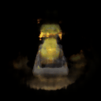

Assignment 4
===================================

## Number of late days used - 1

##  1. Sphere Tracing (30pts)

```bash
python -m a4.main --config-name=torus
```

### Visualization


This should save `part_1.gif` in the `images' folder. Please include this in your submission along with a short writeup describing your implementation.

### Implementational Details

- A variable (`z_vals`) is maintained to keep track of the distance from the `origins` for sampling points.
- Starting from a distance (`z_vals`) zero in the direction of rays along each pixel (given by `directions`), we calculate the points.
- The implicit function is used to generate the distance of the closest surface from these points.
- These distances are then used to update the tracking variable `z_vals`.
    - The variable is updated by simply adding the new found distances.
- This entire process is done for either a fixed number of iterations (`max_iters`) or till all the distances are below some threshold (`eps`).
- The mask is simply calculated as the boolean mask for the condition, dists <= eps
    - All points that are already on the surface or are very close to the surface are marked True.

##  2. Optimizing a Neural SDF (30pts)

```bash
python -m a4.main --config-name=points
```

### Visualizations

| Point Cloud Input | Neural Surface Mesh |
| ----------------- | ------------------- |
|  |  |

### Implementational Details

1. MLP
    - I experimented with the number of layers and the number of neurons per layer and finally settled on the following configuration to get my best result (shown above)
        - \# Layers - 7 (6 hidden + 1 output)
        - \# Neurons per layer - 256
    - The way the overall network has been designed is to have a common MLP (# dists layers - 1).
        - During training, this is expected to learn the features such that it would be able to output the distance for the input embedded point.
        - And with additional layers (# color layers), it can predict the color as well.
2. Loss
    - There are 3 components to this loss
        - **Points loss** - Considering that all the ground truth points should lie on the surface, the average distance of these points from the nearest surface as outputted by the model is the first component. In order to obtain my best result, I had to multiply this with a weight  < 1 (used the same one as inter weight). Without this weight, the model seemed to overfit during training resulting in disjointed/lumpy mesh as can be seen below.

        

        - **Distance loss** - This ensures that not all distances go to 0 by taking the exponential values of the distances. To be honest, I tried removing this to see the impact but couldn't see a big difference in the final results or the losses. However, kept it in cause it wasn't doing any harm and logically it makes sense. Potentially, could try increasing the weight to see its impact.

        - **Eikonal loss** - This ensures that the norm of the gradient of the distances with respect to the points is close to 1. To be honest, I wasn't sure about the intuition behind this constraint. But after reading parts of [Implicit Geometric Regularization for Learning Shapes](https://arxiv.org/pdf/2002.10099.pdf), it started to make sense. I believe this constraint helps ensure that the SDF learned by the model is a plausible one. Considering that the main constraint while training a model to learn the SDF is the Points Loss, it is highly likely that the model could learn some random SDF that is 0 for the GT points but is arbitrary elsewhere. Hence this constraint helps provide a smoother SDF as a consequence of the `plane reproduction` property.

### Experimentations

- Sharing some of the experiments done and the results obtained.

| Layers | Neruons | Iterations | Weighted Point Loss | Results |
| ------ | ------- | ---------- | ------------------- | ------- |
| 6 | 128 | 5k | No |  |
| 6 | 128 | 10k | No |  |
| 6 | 256 | 5k | No |  |
| 6 | 128 | 10k | Yes |  |
| 6 | 128 | 10k | Yes |  |
| 7 | 128 | 5k | No |  |
| 7 | 128 | 10k | No |  |
| **7** | **256** | **10k** | **Yes** |  |
| 8 | 128 | 5k | No |  |
| 8 | 256 | 10k | No |  |


##  3. VolSDF (30 pts)


```bash
python -m a4.main --config-name=volsdf
```

### Alpha


- The above graph shows the SDF to density function for 3 values of alpha (1 (red), 2 (blue), 3 (green)).
- As can be seen above and in the formula, alpha helps scale the CDF function. Thus, it helps control the y-intercept and the maximum value that the function can obtain.

### Beta


- The above graph shows the SDF to density function for 4 values of beta
(0.05 (red), 1e-4 (blue), 1 (green), 100 (orange)).
- As can be seen above and in the formula, beta controls the sharpness of the transition from minimum to maximum. For higher values of beta, this transition is extremely gradual. Thus, for a beta close to infinity, the curve would be a line at y = 0.5. For smaller values of beta, the transition would be instantaneous. Thus, for a beta very close to 0, the function would essentially be a square wave.

1. How does high `beta` bias your learned SDF? What about low `beta`?
    - High beta results in an almost uniform distribution of density and so, results in blurry/not so sharp renders. A low beta on the other hand, results in a very sharp render due to the sudden transition of density from 0 to 1 at the surface.

| Beta Value | Geometry | Colored Model |
| ---------- | -------- | ------------- |
| Low (1e-3) |  |  |
| Default (0.05) |  |  |
| High (1) |  |  |

2. Would an SDF be easier to train with volume rendering and low `beta` or high `beta`? Why?

    - Training would be easier and much faster for a higher beta value. Due to the densities being uniform, the training signal from densitites wouldn't vary with different values, leading to a faster convergence albeit not a good one.

3. Would you be more likely to learn an accurate surface with high `beta` or low `beta`? Why?

    - To obtain an accurate surface, using a low beta value would be beneficial. A low beta value would help identify the surface properly as there is a drastic transition in the density around the surfaces.

### Visualizations

| Geometry | Colored Model |
| ----------------- | ------------------- |
|  |  |

For the above results, I had alpha = 10 and beta = 0.05. I believe this worked well because the beta is low but not too low where in the model can't train properly and ends up learning some unnecessary high frequency details leading to generalization issues.

## 4. Neural Surface Extras (CHOOSE ONE! More than one is extra credit)

### 4.1. Render a Large Scene with Sphere Tracing (10 pts)

Defined a new class `MarvelCubeSDF` to try and recreate the following artifact from the No Way Home movie


```bash
# Single
python -m a4.main --config-name=marvel
```

- **Inner Hollow Sphere (2 visible + 7 invisible)**
    - Made using a sphere and another sphere to hollow it out.
    - 6 additional cubes were used to cut out certain parts.


- **Outer Box (1 visible + 7 invisible)**
    - Made using a cube and another to hollow it out.
    - 6 additional cubes used to cut out certain parts.


- **Dr. Strange's portal ring (1 visible + 3 invisible)**
    - Made using a sphere and another sphere to hollow it out.
    - 2 additional cubes to slice out the ring.


The above has 4 visible and 17 invisible shapes.

Not sure if this counted towards the 20 shapes requirements, defined another class `TrippySDF` to replicate 5 of these leading to **20 visible and 85 invisible shapes**.

```bash
# Multiple
python -m a4.main --config-name=trippy
```


### 4.2 Fewer Training Views (10 pts)

| # Images | Geometry | Colored Model |
| - | -------- | ------------- |
| 10 |  |  |
| 25 |  |  |
| 75 |  |  |
| 100 |  |  |

### 4.3 Alternate SDF to Density Conversions (10 pts)

1. Naive SDF

```bash
# For Naive SDF to Density function
python -m a4.main --config-name=volsdf_naive
```

| s | Geometry | Colored Model |
| - | -------- | ------------- |
| 5 |  |  |
| 25 |  |  |

2. Exponential SDF

```bash
# For Exponential SDF to Density function
python -m a4.main --config-name=volsdf_exp
```

- This is defined as follows


| Beta | Geometry | Colored Model |
| - | -------- | ------------- |
| 0.05 |  |  |
| 1 |  |  |