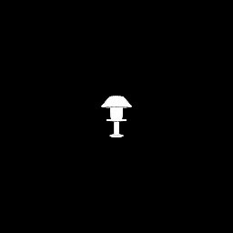
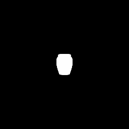
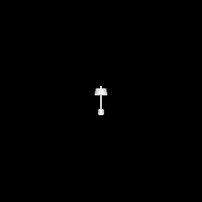
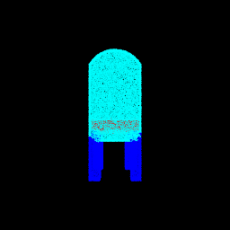
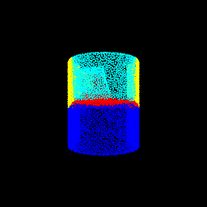

Assignment 5
===================================

## Number of late days used - 0

<br>

## Q1. Classification Model (40 points)

```bash
python main.py -q 1
```

<br>


### Test Accuracy of best model
- **98.111%**

<br>

### Visualization

| Point Cloud | Predicted Class | Ground Truth |
| ----------- | --------------- | ------------ |
|  | Lamp (2) | Chair (0) |
|  | Chair (0) | Vase (1) |
|  | Vase (1) | Lamp (2) |
|  | Chair (0) | Chair (0) |
|  | Vase (1) | Vase (1) |
|  | Lamp (2) | Lamp (2) |

### Interpretation

- While the model performs well with a high test accuracy, there are certain corner cases where the prediction fails. In all such cases, the shape of the actual object resembles the other classes closely. In the above examples, an oddly shaped chair resembles wall mounted lamps closely. Similarly the vase that resembles a couch chair. The lamp is wide and tall and bears resemblance to other vase examples.

## Q2. Segmentation Model (40 points)

```bash
python main.py -q 2
```

<br>


### Test Accuracy of best model
- **90.471%**

<br>

### Visualization

| Predicted Point Cloud | Ground Truth Point Cloud | Accuracy |
| ----------- | --------------- | ------------ |
|  |  | 0.967 |
|  |  | 0.879 |
|  |  | 0.925 |
|  |  | 0.506 |
|  |  | 0.562 |
|  |  | 0.538 |

### Interpretation

- As can be seen, some of the examples for which the model performs the best are standard chairs wherein each section has a clear distinction. However, chairs where in the secctions don't have a clear distinction and are just extended into one another are the ones which the model finds hard to decipher. For example, in the second last example the ground truth shows the handles to be yellow and these are slowly merged into the red area. However, the prediction is unable to find any distinction and the entire thing has been marked as handles. Similar issues/misclassification patterns can be seen in the other 2 bad examples as well.

## Q3. Robustness Analysis (20 points)

<br>

### Experiment 1 - Perturbation

```bash
# For Classification task.
python main.py -q 3-cls-exp1

# For Segmentation task.
python main.py -q 3-seg-exp1
```
- Some noise is added to each point.
- This noise is generated by sampling a random value uniformly from -0.5 to 0.5.
- Then another parameter (`perturb_scale`) is used to scale the noise value up. Therefore, a `perturb_scale = 4` would result in a noise value ranging between -2 to 2.
- The points generated now are then passed through the model and the results are used to analyze the model robustness.

Note: The first row in the tables represent the best model peroformances as shown in task 1 and 2.


| Perturb Scale | Classification Accuracy |
| ------------- | ----------------------- |
| **0** | **0.981** |
| 0.5 | 0.869 |
| 1 | 0.849 |
| 1.5 | 0.675 |
| 2 | 0.647 |
| 3 | 0.647 |
| 4 | 0.647 |
| 5 | 0.647 |
| 6 | 0.647 |
| 7 | 0.647 |


| Perturb Scale | Segmentation Accuracy |
| ------------- | --------------------- |
| **0** | **0.905** |
| 0.5 | 0.66 |
| 1 | 0.561 |
| 1.5 | 0.510 |
| 2 | 0.471 |
| 3 | 0.413 |
| 4 | 0.384 |
| 5 | 0.365 |
| 6 | 0.348 |
| 7 | 0.312 |

<br>

### Experiment 2 - Rotation

```bash
# For Classification task.
python main.py -q 3-cls-exp2

# For Segmentation task.
python main.py -q 3-seg-exp2
```
- The points are rotated by certain angle along each of the 3 axes.
- The angle is determined by the argument `rotation_angle`.
- The points generated now are then passed through the model and the results are used to analyze the model robustness.

Note: The first row in the tables represent the best model peroformances as shown in task 1 and 2.


| Rotation Angle | Classification Accuracy |
| ------------- | ----------------------- |
| **0** | **0.981** |
| 5 | 0.972 |
| 10 | 0.94 |
| 15 | 0.854 |
| 20 | 0.682 |
| 30 | 0.359 |
| 45 | 0.243 |
| 60 | 0.23 |
| 90 | 0.751 |


| Rotation Angle | Segmentation Accuracy |
| ------------- | --------------------- |
| **0** | **0.905** |
| 5 | 0.88 |
| 10 | 0.823 |
| 15 | 0.746 |
| 20 | 0.654 |
| 30 | 0.511 |
| 45 | 0.263 |
| 60 | 0.237 |
| 90 | 0.398 |

<br>

### Experiment 3 - Number of Points

```bash
# For Classification task.
python main.py -q 3-cls-exp3

# For Segmentation task.
python main.py -q 3-seg-exp3
```
- The number of points used for the task are modified.
- This is controlled by the argument `num_points`.
- These points are randomly sampled from the total points.
- The points generated now are then passed through the model and the results are used to analyze the model robustness.

Note: The first row in the tables represent the best model peroformances as shown in task 1 and 2.


| #Points | Classification Accuracy |
| ------------- | ----------------------- |
| **10000** | **0.981** |
| 8000 | 0.981 |
| 6000 | 0.979 |
| 4000 | 0.981 |
| 2000 | 0.98 |
| 1000 | 0.974 |
| 500 | 0.974 |
| 100 | 0.925 |
| 75 | 0.89 |
| 50 | 0.818 |
| 25 | 0.593 |
| 10 | 0.311 |


| #Points | Segmentation Accuracy |
| ------------- | --------------------- |
| **10000** | **0.905** |
| 8000 | 0.905 |
| 6000 | 0.905 |
| 4000 | 0.904 |
| 2000 | 0.904 |
| 1000 | 0.898 |
| 500 | 0.887 |
| 100 | 0.825 |
| 75 | 0.807 |
| 50 | 0.784 |
| 25 | 0.72 |
| 10 | 0.618 |

## Q4. Bonus Question - Locality (20 points)

- Model implemented - PointNet++
    - `PointNet2_Cls` in `locality_models.py`.

|   | PointNet Cls | PointNet++ Cls |
| - | ------------ | -------------- |
| **Test Accuracy** | 98.111% | 93.494% |


### Visualization

| Point Cloud | Predicted Class | Ground Truth |
| ----------- | --------------- | ------------ |
|  | Chair (0) | Chair (0) |
|  | Lamp (2) | Vase (1) |
|  | Chair (0) | Lamp (2) |

- PointNet seems to have a higher accuracy as compared to PointNet++.
- I believe this is mostly due to how constrained the current problem is - just 3 classes.
- However, as expected PointNet++ seems to be more robust.
- Based on the below plot, it can be seen that even as the object is rotated, PointNet++ performs fairly decent and better as compared to just PointNet.


